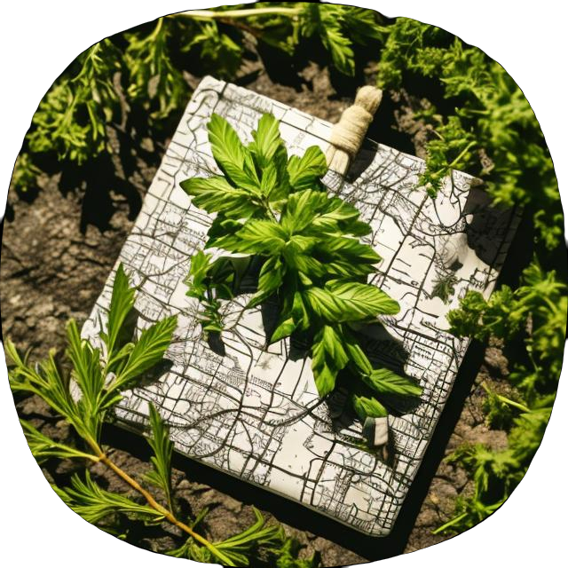
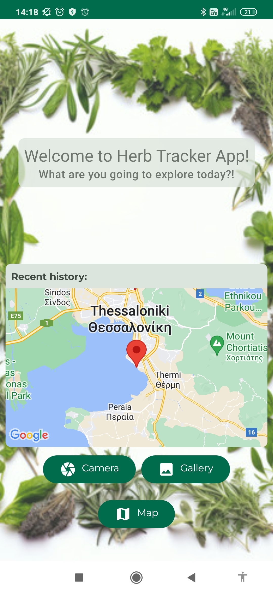
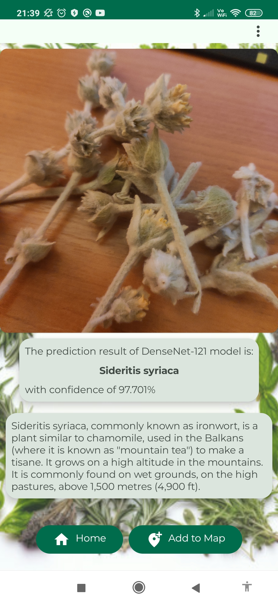
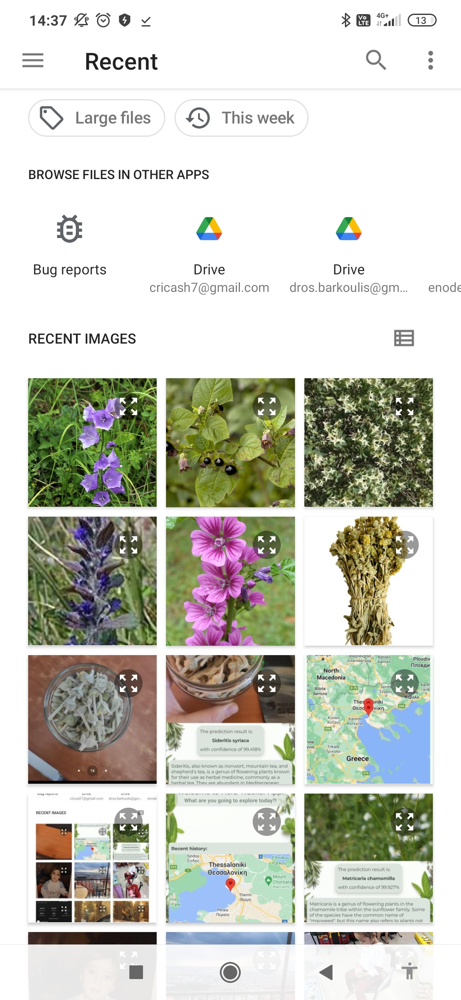
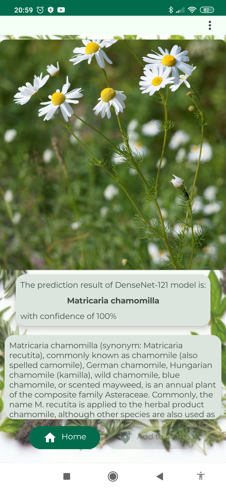
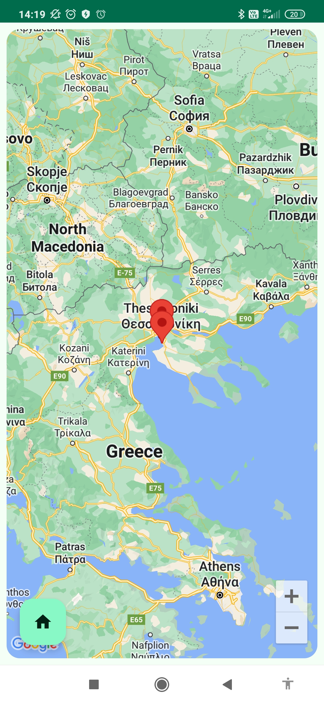

# Herb Tracker Application

||***Herb Tracker is an android application which can recognize various herbs and present information about each recognized herb, it utilizes machine learning techniques and specific algorithms suitable for use on mobile phones. The idea behind Herb Tracker application is a combination of facilitating the public in identifying herbs, but also the shift towards a greener and more sustainable life.***|
|-|-|

| Home Screen | Classification Screen (from Camera) | Model Selection Option |
|-------------|-----------------------|------------------------|
||||
| Classification Screen (from library) | Map Screen |
|||
